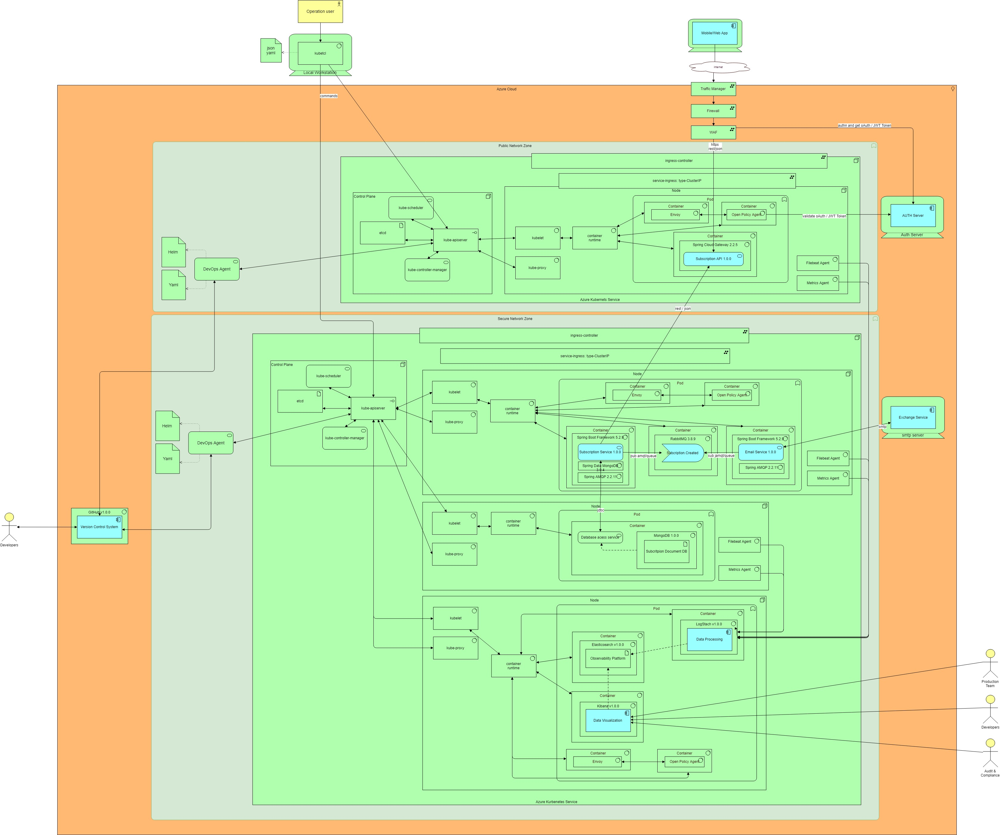
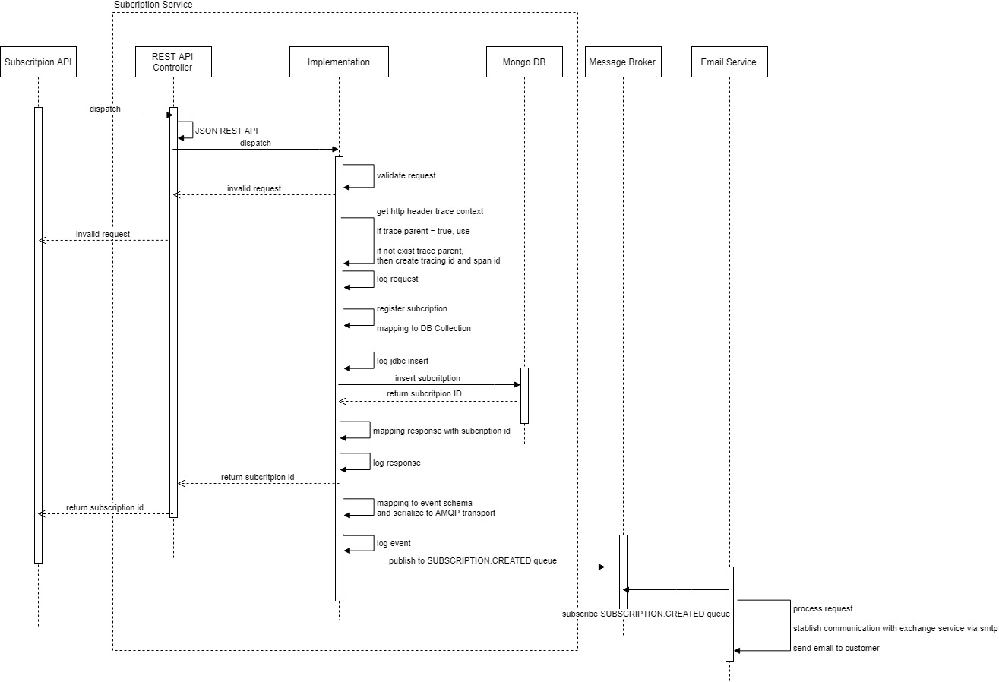

# Subscription Case Study
Case Study to design, code and deploy Subscription Service

## Mission Statement
With the information given and additional assumptions of yours, you should develop an API for SUBSCRIPTIONs using the Java framework of your choice (ideally use Spring Boot) or NodeJS framework of your choice (preferably ExpressJS).   

To create subscriptions a single endpoint will be created: in the public service.

Subscriptions contain: email, firstName, gender, dateOfBith, flag for consent and the newsletter Id corresponding to the campaign. Only gender and firstName are optional values. 

Rest of services receive the same parameters.

Services must be secure, only public service is accessible from the end user.

TIP: an example of a frontend application making use of this service would be similar to https://www.adidas.co.uk/on/demandware.store/Sites-adidas-GB-Site/en_GB/Newsletter-Subscribe

The subscription service has to persist the subscription and returns the ID of the created subscription to the public service.

To complete the subscription process, once the subscription was persisted by the subscription service, someway, the email service will receive the required  information to send an email to the user (take in account the SLAs to choose the best approach for this communication).

## Solution Overview 
All solution design can be consulted in the following presentation stored in `\solution\` folder.



## Subscription Service Overview



## Getting Started

### Requirements
JDK 1.8 or later
Gradle 4+ or Maven 3.2+

You can also import the code straight into your IDE:
Spring Tool Suite (STS)

### Tech stack & Open-source libraries
*   [Spring Boot](https://spring.io/projects/spring-boot) - Framework to ease the bootstrapping and development of new Spring Applications
*   [Spring Data MongoDB](https://spring.io/projects/spring-data-mongodb) - provides integration with the MongoDB document database
*   [Spring Cloud Gateway](https://spring.io/projects/spring-cloud-gateway) - Spring Cloud Gateway aims to provide a simple, yet effective way to route to APIs and provide cross cutting concerns to them such as: security, monitoring/metrics, and resiliency
*   [Spring AMQP](https://spring.io/projects/spring-amqp) - Framework to ease the bootstrapping and development of new Spring Applications
*   [Rabbitt MQ](https://www.rabbitmq.com/) - Open Source Message Broker
* 	[MongoDB](https://www.mongodb.com/) - Open-Source Document Database Management System
*   [ElastickSearch](https://www.elastic.co//) -  Open-Source distributed Observability Platform
*   [Envoy Proxy](https://www.envoyproxy.io/) - Open Source Edge and Service Proxy, designed for cloud-native applications. 
*   [Open Policy Agent](https://www.openpolicyagent.org/) - Open Source Policy-based control for cloud native environments
* 	[Maven](https://maven.apache.org/) - Dependency Management
* 	[Swagger](https://swagger.io/) - Open-Source software framework backed by a large ecosystem of tools that helps developers design, build, document, and consume RESTful Web services.
* 	[git](https://git-scm.com/) - Free and Open-Source distributed version control system
* 	[Azure Kubernertes Service](https://azure.microsoft.com/services/kubernetes-service/) - Kuberneters Service provided by Azure
* 	[Azure Cloud](https://azure.microsoft.com/) - Microsoft Cloud Provider


### Spring Boot 2 REST API Controller
In Spring, a controller class, which is capable of serving REST API requests, is called rest controller. It should be annotated with @RestController annotation.
The resource uris are specified in @RequestMapping annotations. It can be applied at class level and method level both. Complete URI for an API is resolved after adding class level path and method level path.

In given controller, we have one API methods. 

HTTP POST /subscription – Register new subscription and return subcription id 

### @SpringBootApplication
Our REST APIs skeleton is ready. Now we need to configure Spring to detect our rest controller (using auto scanning) and deploy apis in embedded tomcat server. Thankfully, Spring boot makes all these things very easy by using the concept of auto configuration.

Auto-configuration attempts to guess and configure beans we you are likely to need. Auto-configuration classes are usually applied based on the jars in application classpath and the beans we have defined additionally in @Configuration classes.

In this case, it does following things.

It detects spring-webmvc so configure default spring mvc application beans. It help in scan and configure @RestController and similar annotations.
It detects embed tomcat jars so configure embedded tomcat for us.
It detects JSON jars so configure JSON support to APIs.

### Model classes and DAO

```
package com.howtodoinjava.rest.model;
 
public class Subscitption {
  
  public Subscription() {
  }
 
    public Subscription(String email, String firstName, String gender, Date dateOfBirth, Boolean flagConsent,  String newsletterId, String subscriptionId) {
        super();
        this.email = email;
        this.firstName = firstName;
        this.gender = gender;
        this.dateOfBirth = dateOfBirth;
        this.flagConsent = flagConsent;
        this.newsletterId = newsletterId;
        this.subscriptionId = subscriptionId;
    }
  
    private String email;
    private String firstName;
    private String gender;
    private Date dateOfBirth;
    private Boolean flagConsent;
    private String newsletterId;
    private Sring subscriptionId;
 
    //Getters and setters
 
    @Override
    public String toString() {
        return subcriptionId;
    }
}
```

### Running the application locally
There are several ways to run a Spring Boot application on your local machine. One way is to execute the `main` method in the `com.arc.sbtest.SBtemplateApplication` class from your IDE.

* 	Download the zip or clone the Git repository.
* 	Unzip the zip file (if you downloaded one)
* 	Open Command Prompt and Change directory (cd) to folder containing pom.xml
* 	Open Eclipse
	* File -> Import -> Existing Maven Project -> Navigate to the folder where you unzipped the zip
	* Select the project
* 	Choose the Spring Boot Application file (search for @SpringBootApplication)
* 	Right Click on the file and Run as Java Application

Alternatively you can use the [Spring Boot Maven plugin](https://docs.spring.io/spring-boot/docs/current/reference/html/build-tool-plugins-maven-plugin.html) like so:

```shell
mvn spring-boot:run
```

The code can also be built into a jar and then executed/run. Once the jar is built, run the jar by double clicking on it or by using the command `java -jar SBtemplate-0.0.1-SNAPSHOT.jar`

To shutdown the jar, follow the below mentioned steps on a Windows machine.

*	In command prompt execute the **jcmd** command to print a list of all running Java processes
*	**Taskkill /PID PROCESS_ID_OF_RUNNING_APP /F** execute this command by replacing the **PROCESS_ID_OF_RUNNING_APP** with the actual process id of the running jar found out from executing the previous command

The app will start running at <http://localhost:8080>, change the database settings in **application.properties** file as per your need.

### Running the application via docker container

* 	[filipedaraujo/spring-boot-subscription-service](https://hub.docker.com/repository/docker/filipedaraujo/spring-boot-subscription-service) - DockerHub Image

DockerHub Pull Command

```text
docker pull filipedaraujo/spring-boot-subscription-service
```

Ensure you build a jar of the application before building a docker image.  

```text
`mvn package -Dmaven.test.skip=true`    //skip all tests and build. The build once completed is available in target folder
```

```text
`mvn clean package`                     //run all tests and build
```

On Windows machine use **Windows Powershell**, navigate to the project folder where Dockerfile is present.

|                           Command                        |                                 Description                              |
|----------------------------------------------------------|--------------------------------------------------------------------------| 
|`docker images`                                           | take a look at the container images.                                     |
|`docker ps`                                               | list all the running containers.                                         |
|`docker ps -a`                                            | list all the containers, including the ones that have finished executing.|
|**`docker build -t spring-boot-subscription-service .`**  | **Build docker image of the project**                                    |
|**`docker run spring-boot-subscription-service`**         | **run the project's docker container**                                   |
|`docker stop [container_id]`                              | stop a container                                                         |
|`docker rm $(docker ps -aq)`                              | stop and remove all containers                                           |


